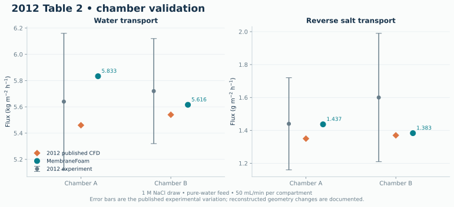
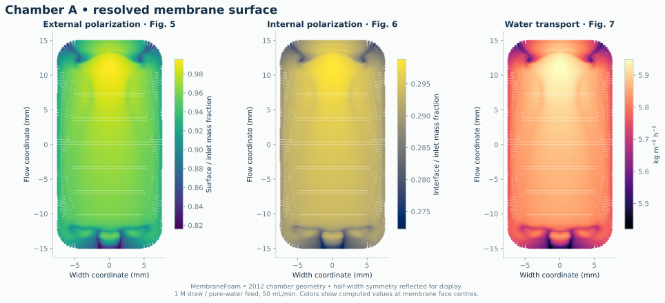
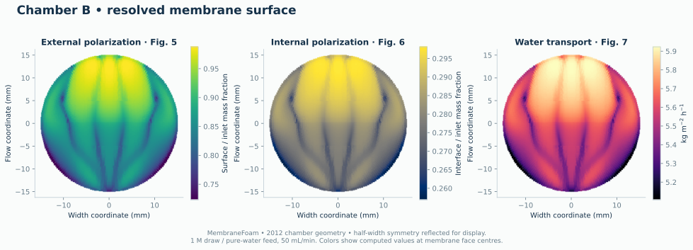
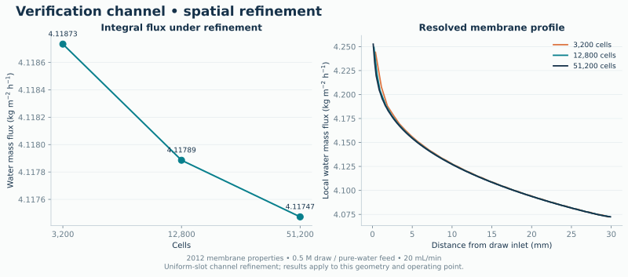
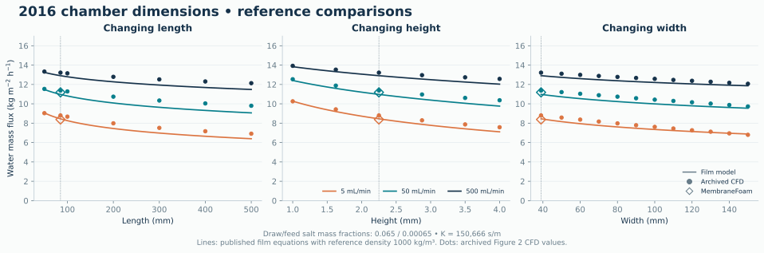
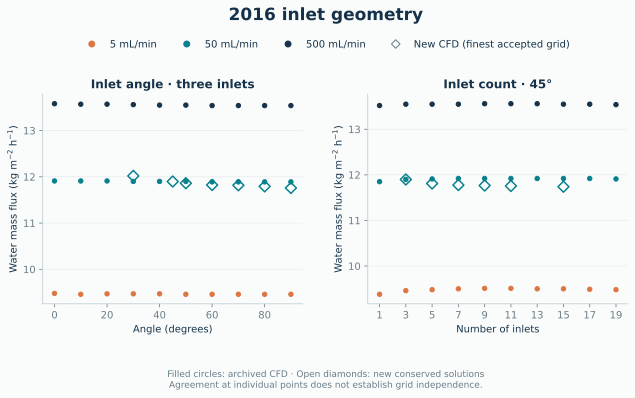
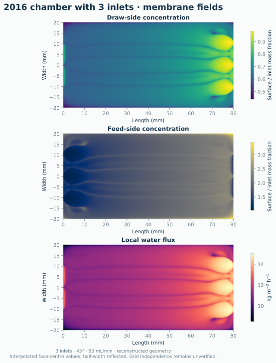
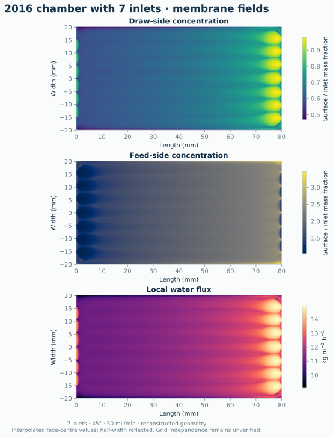

# MembraneFoam

OpenFOAM boundary conditions and laminar solvers for forward osmosis (FO), reverse
osmosis (RO), and concentration polarization. The model couples fluid flow to salt
mass fraction, with concentration-dependent density, viscosity, and diffusivity.

**Supported platform:** OpenCFD OpenFOAM v2606, double precision. Native GPU
execution requires the separate `feature-gpu` build described in
[GPU configuration](docs/gpu.md). OpenFOAM Foundation is unsupported.

## Build and run

Follow the [Linux installation guide](docs/installation.md), then source
OpenCFD OpenFOAM v2606 in a Bash shell:

```bash
source /path/to/OpenFOAM-v2606/etc/bashrc
git clone https://github.com/MathiasGruber/MembraneFoam.git
cd MembraneFoam
./Allwmake
python3 examples/run.py channel runs/first-fo
```

`runs/first-fo` must not already exist. Generated meshes, logs, and time directories
belong outside version control. `Allwmake` stops on the
first error and installs into `FOAM_USER_LIBBIN` and `FOAM_USER_APPBIN`.

The verification case is a uniform-slot channel using the 2012 membrane
properties and chamber-A compartment dimensions. Refine with `--nx` and `--nz`; use
`--mode RO` for a pressure-driven verification case. The single-cell width has
`empty` boundaries and represents a two-dimensional, full-width channel.

## Solvers and fields

| Executable | Purpose |
|---|---|
| `simpleSaltTransport` | Steady laminar flow and salt transport with SIMPLE |
| `pisoSaltTransport` | Transient laminar flow and salt transport with PISO ([usage](docs/reproduction.md#transient-integration)) |
| `potentialSalt` | Initialize flow before a full flow/transport solve |
| `simpleSaltDiffusion` | Steady diffusion with a prescribed `Diff_ratio` field |

Fields are `U` (m/s), `m_A` (salt mass fraction, kg/kg), and `p` (Pa for zero
gravity). `phi` is **mass flux**, kg/s, in the transport solvers; it is volumetric
flux in `potentialSalt`. With gravity, the legacy pressure formulation uses a
reduced hydrostatic pressure. Gravity and variable-density pressure reconstruction
need separate validation before using nonzero `g` in production.

The experimental porous solvers and historical sampling utility remain in `src/`
for reference and are excluded from the supported build. These are laminar
solvers; a fine grid alone is not evidence of resolved turbulence.

## Paper comparisons

The [2012 examples](examples/papers/2012/) generate and solve both chamber
geometries. [Comparison notes](docs/reproduction.md) define parameters, geometry
adjustments, and validation limits. Generate case data and figures with the
commands below. Only the finished figures are versioned; meshes, logs, and collected results stay under `runs/`.

### 2012 chamber validation



Computed water flux is **5.833 kg/(m² h)** for chamber A and **5.616 kg/(m² h)**
for B: 6.8% and 1.4% above the published CFD values, respectively. Both lie within
the reported experimental ranges.





These maps show the quantities in Figures 5–7 at computed face centres; the
simulated half-width is reflected for display. Integral salt imbalance is 0.036%
and 0.15% of membrane salt transfer for A and B, respectively.

### Numerical refinement



This verification channel uses the 2012 membrane properties. The result records
include conservation, residuals, mesh size and the numerical settings. Refinement
of this simpler channel does not establish grid independence of the 3D chambers.

### 2016 chamber dimensions



Lines evaluate the published film equations; dots are the original Figure 2 CFD
reference values. The original plotting scripts specify draw/feed salt mass
fractions of 0.065/0.00065 and support resistance 150,666 s/m. The analytical
curves agree with sampled values from the original figure within its raster
resolution. Open diamonds show new MembraneFoam results.

| Flow (mL/min) | Cells | Computed water flux | Published CFD | Difference |
|---:|---:|---:|---:|---:|
| 5 | 158,912 | 8.382 | 8.80 | −4.7% |
| 50 | 396,340 | 11.184 | 11.37 | −1.6% |

Fluxes are kg/(m² h). Both operating points pass convergence and conservation
checks. Refining the 50 mL/min mesh from 158,912 to 396,340 cells changes water
flux by 0.034%. Three-dimensional grid independence remains unverified.

The `cf042` example reconstructs the chamber from its documented dimensions.
Inlet-transition details are parameterized approximations; CFD agreement and
grid independence remain under validation. See [geometry and parameter
definitions](docs/reproduction.md#2016-chamber-dimensions).

```bash
python3 examples/run.py cf042 runs/cf042-50 --flow 50 --ranks 8 \
    --results runs/results/cf042-50
```

Use `--length`, `--width`, `--height`, and `--offset` (metres) for geometry studies;
`--spacing` and `--layers` control mesh resolution. `--generate-only` writes
CF042 dictionaries without requiring an OpenFOAM installation.

The `3dblock` example generates angled rectangular inlets on an 80 × 40 × 2 mm
channel. Select the inlet count, angle, and mesh refinement with:

```bash
python3 examples/run.py 3dblock runs/block-3 --inlets 3 --angle 45 --ranks 8 \
    --results runs/results/block-3
```

See [inlet geometry](docs/reproduction.md#2016-inlet-geometry) for the definition
and `--refinement` option.



At 50 mL/min and 45°, the three-inlet case gives 11.898 kg/(m² h), compared with
11.90 in the archived CFD. The accepted five-, seven-, nine-, eleven-, and
fifteen-inlet cases give 11.811, 11.776, 11.765, 11.756, and 11.739 kg/(m² h),
0.8% to 1.5% below the archived 11.91 to 11.92.
The three-inlet cases at 30°, 45°, 50°, 60°, 70°, 80°, and 90° differ from the
archived fluxes by −1.1% to +1.0%. All displayed new CFD points pass convergence
and conservation checks. The 45° three-inlet solution
appears in both panels; the full curves and grid independence remain unverified.
Filled circles are archived reference values, not new simulations.





Surface maps show these accepted cases. Concentrations are normalized by each
compartment's inlet value; the simulated half-width is reflected for display.

To run a 2012 chamber case:

```bash
python3 examples/run.py chamber-b runs/paper-2012-b --ranks 8 \
    --results runs/results/chamber-b
```

Generate figures from completed runs:

```bash
python3 -m pip install -r examples/requirements.txt
python3 examples/plot.py --results runs/results
```

SVG figures are saved in `docs/figures`.

Use `chamber-a` for chamber A, or `--setup-only` to prepare the mesh and initial fields
for a separate GPU or batch run. Each command requires a new output directory.

## Boundary conditions

Both sides of a conformal membrane baffle must belong to the **same patch**.
Each face needs exactly one coincident partner of equal area and opposite normal.
The default pairing tolerance is 1 nm. Specify `forwardDirection` from the feed
into the draw compartment. Face ordering is unrestricted. If decomposing a case,
keep partners on the same MPI rank; the channel example decomposes along its
length. The chamber launcher adds `preserveBaffles` constraints. Invalid pairing
terminates the run.

```foam
// In 0/U, for forward osmosis
membrane
{
    type explicitFOmembraneVelocity;
    forwardDirection (0 0 1);
    eq advanced;
    value uniform (0 0 0);
}
// In 0/m_A
membrane
{
    type explicitFOmembraneSolute;
    value uniform 0;
}
```

Load `libs ("libDHIBoundaryConditions.so");` in `system/controlDict`. Set `A`, `B`,
`K`, and fluid properties in `constant/transportProperties` as in the generated
case. FO `A` is m/(Pa s), `B` is m/s, and `K` is s/m. The historical RO boundary
uses **patch-local `K` for water permeability**, in m/(Pa s), and patch-local `R`
for salt rejection. These two uses of `K` have different units.

FO `eq advanced` implements finite salt permeability; `eq simple` is the
high-rejection approximation. Both assume AL-FS orientation and no
hydraulic pressure difference. Reversed osmotic driving is rejected explicitly.
See [model reference](docs/model.md) for equations, signs, and limits.

## Validation and development

```bash
c++ -std=c++17 -Wall -Wextra -Isrc/membraneModels \
    tests/unit/test_flux.cpp -o /tmp/test-membrane-flux
/tmp/test-membrane-flux
```

CFD runs emit `MEMBRANE_CHECK` physical balances, `MEMBRANE_DISCRETE` finite-volume
salt fluxes, and a membrane-surface CSV. The steady solver requires both residual
convergence and a salt imbalance below `SIMPLE.maxRelativeSaltImbalance`
(default 0.01, relative to membrane salt transfer).
For unsteady runs, `MEMBRANE_TRANSIENT` includes salt accumulation and discrete
boundary fluxes in its conservation audit, using the selected time scheme.
Run summaries distinguish process completion from SIMPLE convergence. CPU and
GPU runs use the same conservation criteria.

## Citation

- Gruber et al. (2011), *Computational fluid dynamics simulations of flow and
  concentration polarization in forward osmosis membrane systems*,
  [Journal of Membrane Science](https://doi.org/10.1016/j.memsci.2011.06.022).
- Gruber et al. (2012), *Validation and analysis of forward osmosis CFD model in
  complex 3D geometries*, [Membranes](https://doi.org/10.3390/membranes2040764).
- Gruber, Aslak and Hélix-Nielsen (2016), *Open-source CFD model for optimization
  of forward osmosis and reverse osmosis membrane modules*,
  [Separation and Purification Technology](https://doi.org/10.1016/j.seppur.2015.12.017).

See [LICENSE](LICENSE). Original source copyright and license notices are retained.
